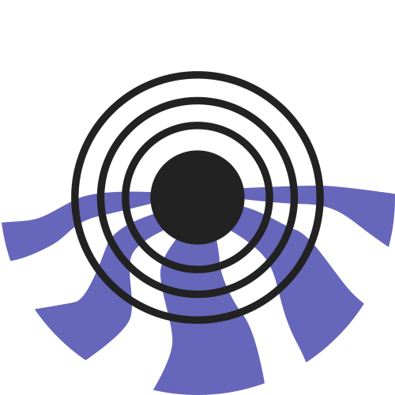
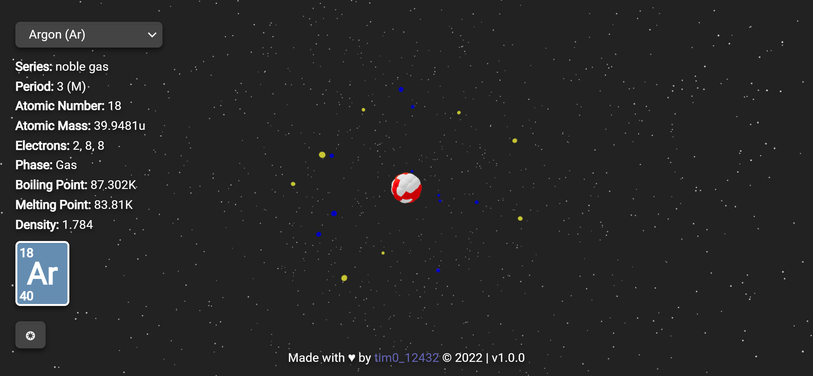
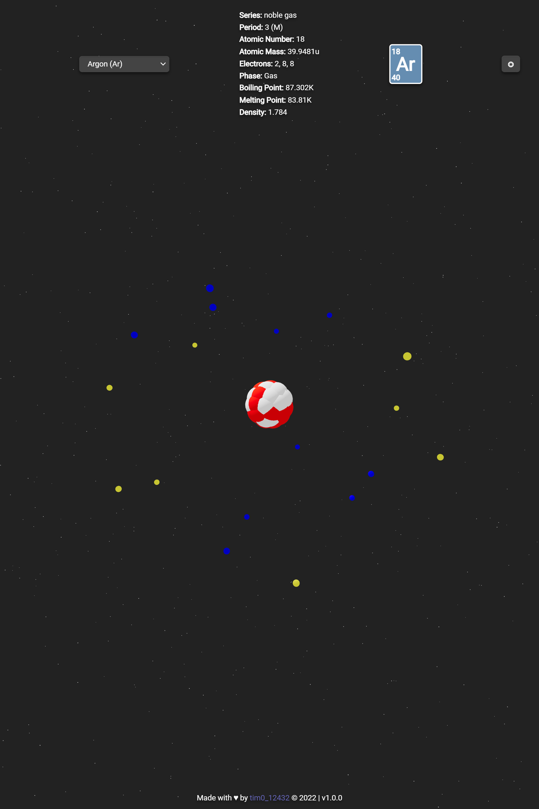

    
    <h1>Hvergelmir</h1>

<h3>A periodic table atom 3D viewer</h3>

## Screenshots

 
 

## How to use

Go to [tim0-12432.github.io/hvergelmir](https://tim0-12432.github.io/hvergelmir) and check it out!

## License

Licensed under [MIT](./LICENSE.md)
